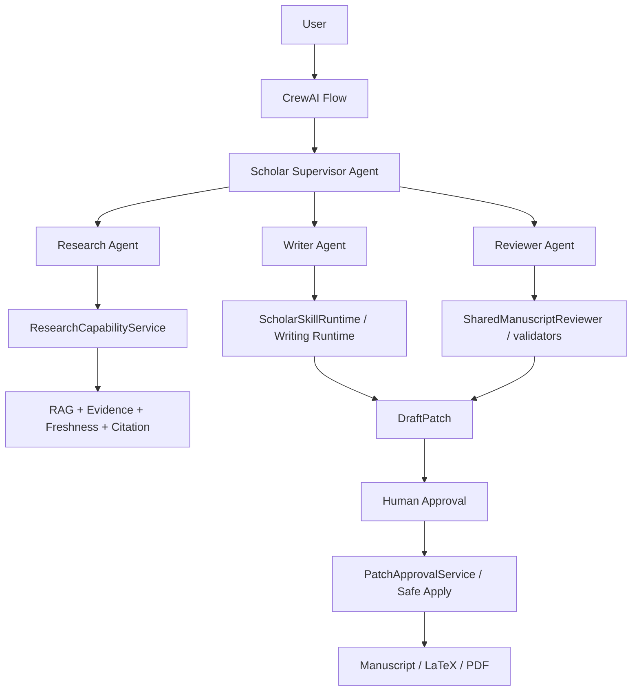
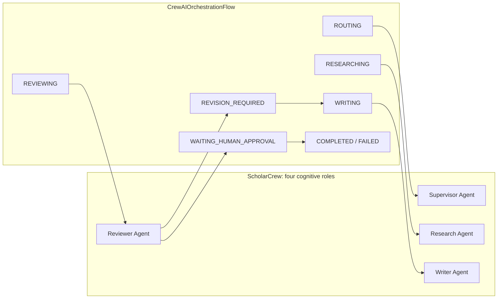
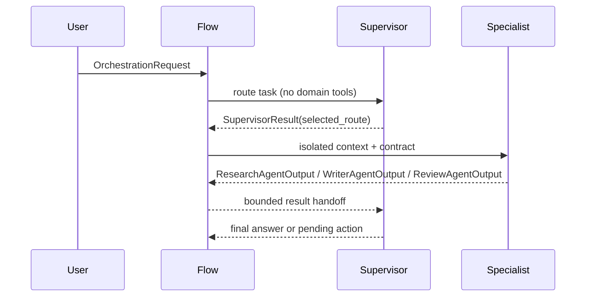
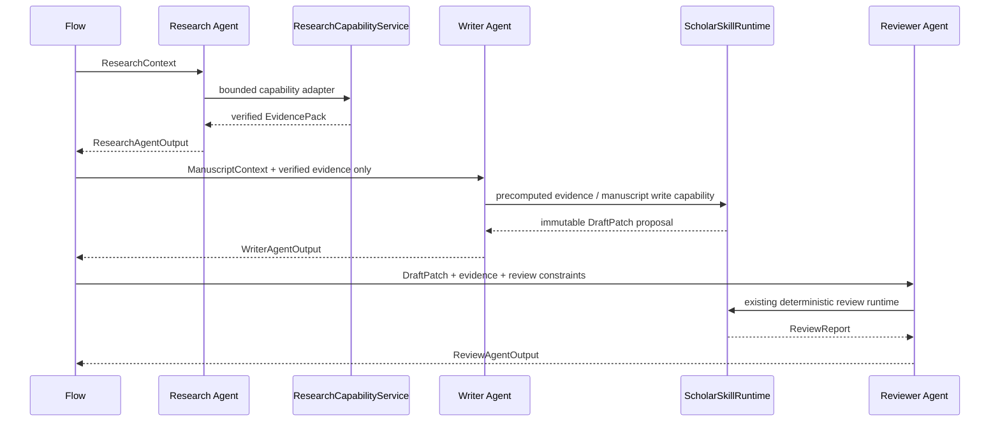
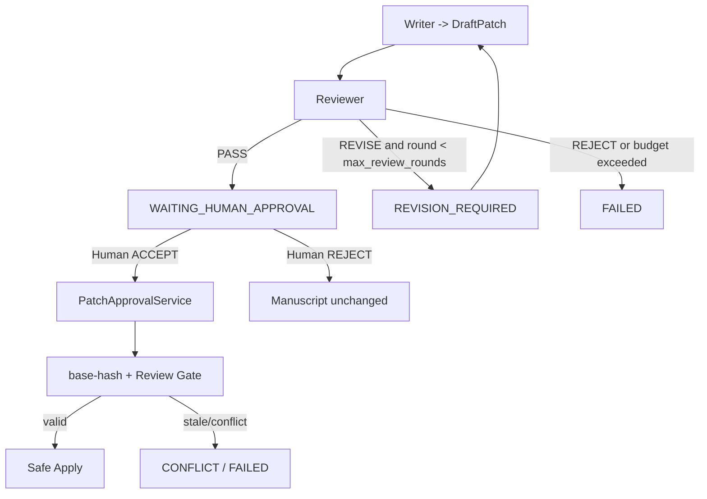
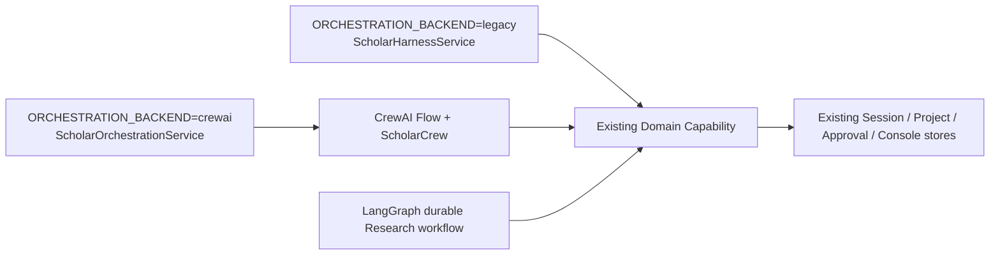

# CrewAI + Flow Scholar Orchestration

本文描述 `app/orchestration/` 的实际 V1 实现。CrewAI 是 Production 的顶层
`crewai` backend，Legacy Deep Agents/LangGraph 保留为显式 fallback；测试模式
仍可使用 legacy，避免破坏旧测试与离线工具。

## 职责边界



Agent 是认知角色，Tool 是 capability adapter，Service 是确定性领域逻辑，
Flow 是业务状态机。没有 Database Agent、Citation Agent、Approval Agent 或
Memory Agent。

## Crew 与 Flow



`ScholarCrew` 每次只 kickoff 一个带 `Task.output_pydantic` 的 Specialist Task；
Flow 决定何时 kickoff、是否允许修订以及何时停止。CrewAI Memory 显式关闭，
Flow state 只保存当前运行的引用和结构化 contract。

## Supervisor delegation



监督 Agent 的输出不能通过字符串匹配驱动状态；Flow 只接受 Pydantic contract。
确定性 `TaskRouter` 仅产生 route hint，最终 route 必须与 Supervisor contract
一致，否则 fail closed。

## Research → Writer → Reviewer



Introduction 的 ResearchPack 以 request-scoped handoff 传给 Writing Runtime，避免
Writer 自己搜索；Conclusion/Abstract 不触发 Research，缺少 upstream state 时由
现有 `INSUFFICIENT_MANUSCRIPT_STATE` / `UPSTREAM_SECTION_STALE` fail closed。

## Revision loop and approval boundary



任何 Agent 都不能调用 `approve()`、`reject()` 或 Safe Apply。Writing Runtime 只
注册 DraftPatch；Reviewer PASS 后 Flow 只创建 pending action 并结束为
`WAITING_HUMAN_APPROVAL`。真实的 Accept/Reject 仍由已有 HTTP/CLI Approval API
处理，因此 duplicate approve、stale hash 和 session restart 继续由同一套
idempotency / hash guard 负责。

## Capability matrix

| Role | Allowed boundary | Explicitly forbidden |
| --- | --- | --- |
| Supervisor | route、读取任务级 specialist result | RAG、Web、Write、Review、Approval、Apply |
| Research | local/web Research、Evidence、Citation resolution | DraftPatch、Manuscript write、Approval、Apply |
| Writer | Manuscript/Facts/Contributions read、verified Evidence、DraftPatch proposal | Web Research、Facts write、Safe Apply |
| Reviewer | DraftPatch/Evidence/Facts read、deterministic Review | Research、Manuscript write、Approval、Apply |
| Human | Approval decision | 无 Agent 身份；只经 `PatchApprovalService` 进入 Safe Apply |

代码中的 `CapabilityMatrix` 只是可见性投影；真正权限仍由既有
`CapabilityProfile`、Skill Runtime 和 domain service 再次验证。

## Contracts, context and persistence

`ResearchAgentOutput`、`WriterAgentOutput`、`ReviewAgentOutput` 和
`SupervisorResult` 位于 `app/orchestration/contracts.py`，同时用于 CrewAI
structured output 与 Flow 二次校验。Research、Writer、Reviewer 分别只收到
ResearchContext、Manuscript/verified-evidence context、DraftPatch/review context。

`FlowState` 只保存 `project_id/session_id/run_id/thread_id/trace_id`、当前 route、
review round、pending approval 和本次 contract 引用。Project、Session、Run、
Evidence、DraftPatch 仍由现有 stores 持久化；不启用 CrewAI long-term Memory。

`CrewAITraceAdapter` 监听 CrewAI 的 Agent/Task/Tool/Crew/Flow event bus，并把真实
framework event 投影到现有 Session result metadata 的 trace。Web Console 继续通过
`ScholarConsoleProjection` replay 这份 trace，未伪造 evaluator 事件。

Offline release validation uses the real CrewAI Flow/Crew and the real domain
capability graph with an injectable deterministic provider:

```bash
uv run python scripts/run_scholar_final_e2e.py \
  --project-root /path/to/copy-of-scholar-project \
  --data-root /path/to/leo-research-agent/data \
  --skills-root /path/to/leo-research-agent/skills \
  --fixture-provider \
  --orchestration-backend crewai
```

The script remains opt-in and does not alter the repository's default backend.
Its final summaries expose `backend`, route, approval state, patch reference
and the correlated `trace_id` for replay.

## Provider and migration

`CrewAIProviderAdapter` 包装项目已有 `chat_completion` provider，也接受现成的
CrewAI `BaseLLM` 或可注入的 local `invoke` stub。DeepSeek/OpenAI-compatible、
Ollama/local gateway 的差异留在 Provider 层；Agent 不包含 provider-specific HTTP。
没有 provider 时，测试和 local dry-run 使用无网络 deterministic contract model。



Legacy 与 CrewAI 共享 domain graph；LangGraph 仍可作为内部 durable Research
workflow。

## Migration gates

| Gate | Status |
| --- | --- |
| CrewAI 1.15.21 locked and real Flow/Crew path exercised | IMPLEMENTED |
| Local deterministic E2E command | IMPLEMENTED; requires an isolated LaTeX project fixture |
| Legacy vs CrewAI parity dataset and latency/token/cost comparison | IMPLEMENTED as `scripts/evaluate_orchestration_parity.py`; final four-case release measurement verified |
| CrewAI as Production default | IMPLEMENTED; `crewai` is the production default and legacy remains fallback |
| Durable CrewAI Flow resume after process restart | IMPLEMENTED by Project Runtime checkpoint/reconstruction; native CrewAI Memory is not used as durability |

External Provider E2E remains an explicit release input. The current closure
verified the unchanged four-case evaluation against the configured real
Provider: Support Claim, Introduction, Conclusion and Abstract all passed;
Introduction also completed real approval/apply. A provider-unavailable run
returned `FAILED` without a fabricated answer. The current release result is
therefore `CREWAI_PRODUCTION_READY`; a later environment that has not explicitly
verified its Provider remains `CREWAI_PRODUCTION_EXTERNAL_BLOCKED`.

The local release gate also requires the persisted Paper/Content Knowledge
Index projection to be ready. This check is read-only: `release-check` and
`/ready` never run `hierarchical build`, and Docker startup never performs an
implicit full rebuild. Use `uv run python main.py knowledge status` for the
current provenance and `uv run python main.py hierarchical build` for an
explicit administrator synchronization.
