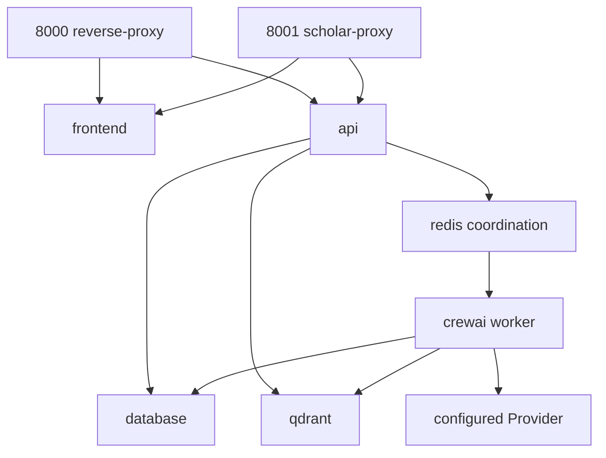

# Self-hosted Docker Compose Deployment



The local implementation uses the existing WAL-backed SQLite stores for
single-host reliability. Redis is present for queue wakeup/coordination in
Compose, not as the business source of truth. A multi-host installation must
point Session/Run/Approval stores at the configured transactional database.

`/health` is liveness only and does not depend on the Knowledge Index or an
external Provider. `/ready` probes configured Redis and Qdrant endpoints with
short timeouts, reports Worker heartbeat state, and returns the read-only
Paper/Content Knowledge Index projection. A missing or stale index makes
`research_readiness=degraded` while `application_runtime`, Session, Run and
Approval remain available; the endpoint does not start a rebuild. The exact
index state is available from:

```bash
uv run python main.py knowledge status
```

Index initialization/synchronization is an explicit administrator operation:

```bash
uv run python main.py hierarchical build
```

Normal execution reuses unchanged document-level Level-2 structures, chunks
and vectors. `--force` is reserved for an explicit administrator rebuild.
Docker startup never runs either command implicitly. The current Run/Job/
Approval lifecycle remains SQLite-WAL based; MySQL is the structured knowledge
repository and is enabled by the Compose deployment, while a full transaction-
store migration remains a separate release item.

Secrets are supplied through environment variables or secret mounts. They are
not copied into images, Job payloads, RunEvents, or frontend bundles.

The Compose API and Worker use `LEO_PROJECT_ROOT=/app`. Application code,
`main.py`, skills, MinerU, PaddleOCR, the table worker and the formula worker
are all copied into the Linux image. Compose does not bind-mount the host
source tree, `data/`, `.scholar/`, or `.env` into either service. Persistent
papers, parsed artifacts, indexes, model caches, Scholar state and uploaded
manuscripts live in the Docker-managed `leo_data` and `leo_scholar` volumes.
The only host-side inputs are Compose environment variables for deployment
configuration/secrets and HTTP uploads through the web UI.

The `LEO_PROJECT_ROOT_ALIASES=/app/workspace` setting preserves project
identity when reusing a volume created by the former workspace-mount layout;
it is not a runtime filesystem dependency. To migrate an existing local data
directory once, copy it into the named `leo_data` volume before starting the
new API/Worker, while keeping the original directory as a backup.
