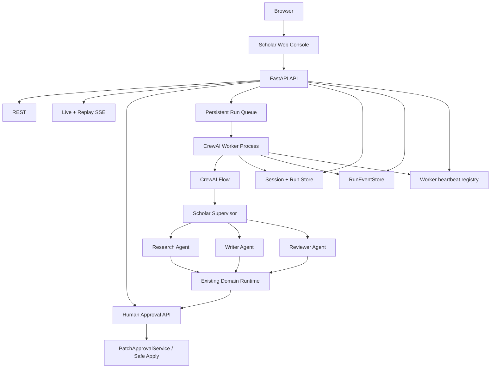

# Scholar Research Agent Production Architecture

## Authority boundaries

CrewAI owns bounded multi-agent cognition. The CrewAI Flow owns deterministic
state transitions. The Worker owns asynchronous execution. Session/Run stores
own lifecycle and durable domain projections. RunEventStore owns the product
trace. The Web Console is a read/control projection. Human Approval is the
mandatory side-effect boundary; manuscript writes remain inside
`PatchApprovalService`.



The four-agent boundary is fixed: Supervisor, Research, Writer, Reviewer.
CrewAI memory is disabled and is never a durable state source.

## Runtime readiness

Readiness is split into independent projections:

```text
/health  -> process liveness only
/ready   -> infrastructure/runtime + worker + Knowledge Index projection
knowledge status -> administrator detail and index provenance
release-check -> local engineering gate + explicit external Provider gate
```

The Knowledge Index projection reports `paper_bm25`, `paper_dense`,
`content_bm25`, `content_dense`, `manifest_status`, `corpus_revision` and
`embedding_revision`. A `not_initialized`, `degraded` or `stale` index never
causes `/health` to fail and never starts an implicit rebuild. `/ready` reports
`research_readiness=degraded` while the Web Console, Session, Run and Approval
surfaces can remain available.

Index synchronization is explicit:

```bash
uv run python main.py knowledge status
uv run python main.py hierarchical build
uv run python main.py hierarchical build --force  # administrator only
```

The normal build preserves document-level Level-2 incremental indexing. A new
paper updates only its Level-2 chunks and vectors; if the Paper metadata corpus
changes, the global Level-1 Paper vectors are regenerated as required by the
frozen architecture.

The approval endpoint calls `PatchApprovalService` first. Once the decision is
durable, it emits an approval event and enqueues an idempotent Run
reconciliation Job; the Worker then closes the originating Run. The endpoint
never applies manuscript state outside `PatchApprovalService`.
