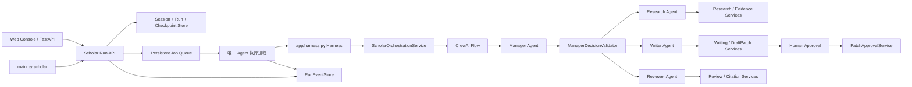

# CrewAI Scholar 生产架构

本文是项目唯一的生产架构说明。系统只有一条 CrewAI 链路：Web 和 CLI
负责提交/查询，Persistent Worker 负责执行，CrewAI Flow 负责有界的
Manager、Research、Writer、Reviewer 多 Agent 协作。Web、CLI 不直接运行 Agent。

## 总体链路



入口只有三种部署角色：

- Web：`app/web/api.py` 只创建控制面，`POST /api/scholar/runs` 只持久化并入队；
  `GET /api/scholar/runs/{run_id}` 和事件流只读取投影，不构建 `Harness`。
- CLI：`main.py scholar request|resume|status` 使用同一个
  `ScholarRunManager`；`jobs work` 或 `scripts/run_scholar_worker.py` 才执行
  队列中的 Agent Job。
- Worker：`ScholarRunWorker` 是唯一会调用 `Harness` 和
  `ScholarOrchestrationService.run()` 的进程。Worker 重启先恢复过期 lease，
  再按 Job checkpoint 继续或失败关闭。

`Harness` 是唯一生产组装根，负责创建 Session、Project、Corpus / Index、Research
Capability、Writing Runtime、Approval Service、CrewAI Backend 和事件投影。测试
可以注入 domain double，但不能选择另一种生产编排框架。

## 一次 Run 的状态边界

```text
create request
  -> durable Run + scholar.run Job
  -> Worker claim / heartbeat / cancellation checkpoint
  -> CrewAI Flow
  -> final result or human approval checkpoint
  -> Run/Event projection
```

`OrchestrationRequest` 保存项目、Session、任务类型、原始指令和租户身份。
`RunGoal` 在创建时固定原始目标、成功条件和硬约束；它不会被最近消息、单个
Reviewer 意见或 Specialist 输出覆盖。`RunState` 只保存阶段、计数器、短摘要和
`DomainResultReference`，不复制完整 EvidencePack、DraftPatch 或 ReviewReport。

Session Runtime 的 SQLite 数据库保存 Conversation、Run 元数据、Goal 和
checkpoint；Job Repository 保存队列、lease、retry、取消和结果引用；
`RunEventStore` 保存可重放事件。三者职责不同，任何自然语言消息都不是运行进度
的事实源。

## CrewAI 多 Agent 协作

CrewAI 的角色固定为四个：

| 角色 | 负责 | 不负责 |
| --- | --- | --- |
| Manager | 读取有界 Run 投影，提出一个 `ManagerDecision` | 不能直接检索、写稿、审阅、审批或 Apply |
| Research | 调用 Research Capability，返回可追溯 Evidence/Citation | 不能创建 DraftPatch 或修改稿件 |
| Writer | 基于已验证证据和稿件投影生成 DraftPatch | 不能自行 Research 或 Apply |
| Reviewer | 检查事实、证据、引用和 DraftPatch，返回 PASS/REVISE/REJECT | 不能写入稿件或批准变更 |

每一轮都是同一条确定性 Flow：

```text
bounded Run projection
  -> Manager Agent: ManagerDecision
  -> ManagerDecisionValidator
  -> exactly one specialist capability
  -> bounded specialist output + domain reference
  -> RunState/checkpoint update
  -> Manager Agent
```

Manager 的动作只有 `CALL_RESEARCH`、`CALL_WRITER`、`CALL_REVIEWER`、
`REQUEST_MORE_EVIDENCE`、`REQUEST_REVISION` 和 `COMPLETE`。Flow/Validator 而非
Prompt 决定动作是否合法，并强制任务类型、目标对齐、Research/Review/Manager/
Tool/Token budget、无进展检测以及终态条件。CrewAI Memory 关闭，Agent 之间只传
有界 contract，不把完整聊天历史作为隐式记忆。

Research 的本地检索经过 `app/knowledge/service.py`、Evidence Governance 和
`ResearchCapabilityService`；外部文献经过同一 Capability 的 Web provider。
Writer 和 Reviewer 只能通过已有 Scholar domain service 访问稿件、事实、贡献、
证据和引用。Agent 不接触 Qdrant、BM25 文件、SQLite 或模型 HTTP 客户端。

## 写作、审批和失败恢复

Writer 生成不可变 DraftPatch，Reviewer 通过后 Run 进入
`WAITING_HUMAN_APPROVAL`。Human Approval API 先将决定写入
`PatchApprovalService`，检查 review gate 和 base hash，再提交一个幂等的
reconciliation Job；只有 `PatchApprovalService` 能安全 Apply。Worker 恢复时只
读取已持久化的 Patch/Approval 状态，不把调用方传入的任意 resume payload 当作
授权信号。

每个 Specialist action 前写入可重放的 recovery action。Worker lease 失效后，
旧 Job 进入 interrupted/retry 状态；恢复使用同一 `session_id`、`run_id`、
`thread_id` 和 checkpoint。结果成功持久化后清理 checkpoint；失败、取消、预算
耗尽和人工拒绝均写入终态事件，不能由过期 Worker 覆盖。

## 代码边界

```text
app/web/api.py                  Web API / read-control projection
main.py                         CLI submission and operational commands
app/scholar/runs.py             Run manager and Scholar Worker
app/harness.py                 Harness（唯一 Runtime 组装与生命周期入口）
app/orchestration/service.py   CrewAI backend application adapter
app/orchestration/crewai/     CrewAI Flow, agents, tools and tracing
app/scholar/research/          Research capabilities and provider gateway
app/scholar/writing/           Writing and review domain services
app/session/                   Session, Run and checkpoint persistence
app/jobs/                      Persistent queue, lease and generic worker
```

`CapabilityBudget` 是 Research Capability 内部的工具额度，不是独立的编排入口。
`Harness` 只负责依赖组装、资源生命周期和 CrewAI Runtime 交付，不接管 Manager
决策；跨 Agent 编排仍由 CrewAI Flow 负责，避免再出现第二个总控层。
