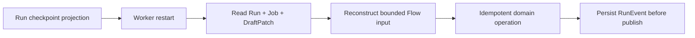

# Durable and Recovery Strategy

Project Runtime owns durability; CrewAI owns agent execution.

- Research, Writer, and Reviewer are replayable cognition steps. Their
  bounded domain contracts are reconstructed from the Run and domain stores.
- DraftPatch registration is idempotent and guarded by project/base hash.
- Approval and Safe Apply remain exclusively in `PatchApprovalService`.
- A lost Worker heartbeat marks the Job and Run `INTERRUPTED`; retry policy
  moves it to `RETRY_PENDING` or terminal `FAILED`.
- Approval after restart is reconciled from the persisted Patch status. The
  caller's resume value is never interpreted as authorization.
- Worker liveness is projected separately through the durable heartbeat
  registry. The API reports `RUNNING`, `STOPPED`, or derived `STALE` status;
  this registry is observability state and cannot advance a Run by itself.
