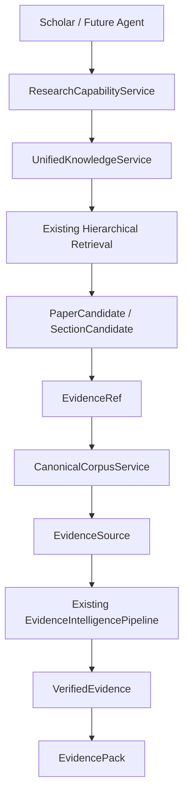

# Research Capability Contract

## 当前边界

Phase 1C 将现有本地 Research Engine 投影为三个可组合 capability：
`ResearchCapabilityService.search_papers()` 负责 paper-level discovery，
`search_sections()` 负责已筛选论文中的 section/chunk candidate discovery，
`read_evidence()` 只按已返回的 canonical locator 读取原文。它们位于
`app/scholar/research/service.py`，不拥有 Session、Project、Conversation 或 Research Run，
也不实现新的检索算法。LangChain/Deep Agents Tool 只能包一层调用该 Service，不能把
Qdrant、BM25、BGE-M3、RRF 或 Reranker 暴露到上层。



## Contract 与 Evidence 生命周期

`ResearchRequest` 表达 query、purpose、target claims、section preference、时间/论文过滤和
`ResearchBudget`，不包含任何 retrieval implementation 参数。`PaperCandidate`、
`SectionCandidate`、`EvidenceRef` 和 `EvidenceSource` 是 capability 的稳定投影；
EvidenceCandidate 直接复用 `app.contracts.CandidateEvidence`，Verified Evidence 直接复用
`app.contracts.VerifiedEvidence`，避免第二套同义来源模型。`EvidencePack` 继续复用
`app.scholar.models.EvidencePack`，增加 coverage、counter_evidence 和 metadata，同时保留
现有 `local_coverage` 字段的兼容性。

```text
ResearchRequest
    -> search_papers()
    -> search_sections()
    -> read_evidence(EvidenceRef[])
    -> EvidenceCandidate
    -> deterministic locator/source/workspace validation
    -> EvidenceIntelligencePipeline.verify()
    -> EvidenceIntelligencePipeline.select()
    -> EvidencePack
```

`read_evidence()` 的事实源是 CanonicalCorpusService。它会验证 paper/document/section/chunk/
block 的归属关系，并返回 canonical text、page、block 和 metadata；page 不存在时保持空值，
不会由模型补造。Candidate 在进入既有 Pipeline 前还会检查 request identity、canonical
locator、paper/work/block 归属和非图候选的 source text；随后由 Workspace scope、来源校验、
去重、多样性、排序和 token budget 规则继续治理。没有真实 locator 的候选不能成为
Verified Evidence。

## 并发检索边界

Paper-Level 检索不是对每篇论文逐一发送请求：一次 hierarchical retrieval 会在统一的
Paper-Level 索引中返回最多 20 篇候选，随后在这些 `paper_id` 范围内执行 Level-2 混合检索。
Introduction 的多个独立 `ResearchNeed`（背景、已有工作、局限性）现在由
`ResearchDelegate` 以受控并发执行；当 Content Top-K 集中在少数论文时，5 篇以内的
`paper_id` 覆盖补齐查询也会一次性提交到并发池，而不是按论文逐篇等待。默认最多 3
路；生产部署可通过 `LEO_SCHOLAR_RESEARCH_MAX_CONCURRENCY` 调整并发度，范围为 1 到 8。

并发只改变独立请求的调度，不改变 EvidencePack 和 ClaimPlan 的顺序：结果按原始
ResearchNeed/Paper-Level rank 恢复，因此引用绑定、证据校验和失败语义保持确定性。
本地 Qdrant/BGE 访问由有界信号量保护，Evidence Governance 的共享诊断边界单独串行化；
这不是把 5 篇论文重新向量化，而是让 5 个独立的 Level-2 检索请求并行使用已有索引。

## 搜索语义与预算

`search_papers()` 调用 `UnifiedKnowledgeService` 的既有 hierarchical 入口，只投影论文元数据，
不会返回全文或向量内部信息。`search_sections()` 在已有 paper filter 上执行同一层级检索，
再依据当前 corpus 的真实 section metadata 做最小 section type normalization，不引入新的
section ontology；结果只返回 section locator、chunk id 和短 preview。`read_evidence()` 不会
重新自由搜索。三个入口均受 `ResearchBudget.max_papers`、`max_sections` 和
`max_evidence_items` 限制，超出预算返回 `ResearchBudgetExceeded`。Phase 1C 的基线固定
`web_used=False`；当前 `research()` 通过 Phase 2D `FreshnessPolicy` 和注入的
`WebLiteratureAdapter` 受控扩展 Web，不改变上述本地 Evidence Contract。

当 `target_claims` 存在时，EvidencePack 用确定性的 claim token overlap 生成 claim-to-evidence
映射；没有匹配证据的 claim 进入 unresolved，coverage 是
`supported_claims / required_claims`。没有显式 claim 时 coverage 为 `None`，并通过兼容字段
`local_coverage=0.0` 表示没有可计算的 claim coverage。没有把“没有找到支持”解释成反证，
counter evidence 只保留为未来扩展字段。

## 依赖和所有权

Capability Service 只读使用 Shared Knowledge 和 Evidence Pipeline；它不创建 Session，不写
Manuscript Facts、Contribution Registry、LaTeX 或 Session DB。普通用户的完整 Research Run
仍然由 `ResearchApplicationFacade` 管理；Deep Agents Research Subagent 只能组合该
Capability，二者在 UnifiedKnowledgeService 和 EvidenceIntelligencePipeline 处复用同一实现。
Web Literature 仍只能通过 `ResearchRequest`、FreshnessPolicy 和既有 Tool Gateway Adapter
进入；Persistent Checkpointer 只保存 Harness/Graph working state，不改变本 Capability 的业务所有权。
