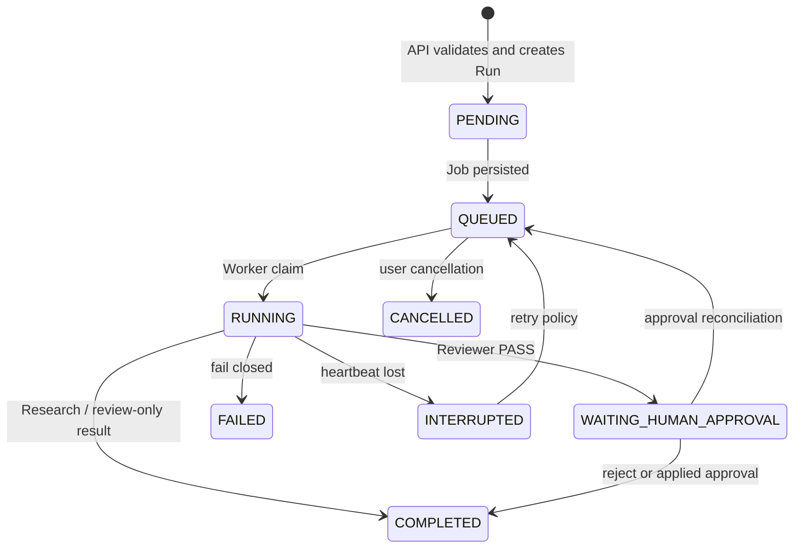

# Run Lifecycle

`WAITING_HUMAN_APPROVAL` is stored compatibly as `WAITING_USER` in the legacy
SessionRuntime schema and exposed with the production name at the async Run
API. A Run and its Job always carry `run_id`, `session_id`, `project_id`,
`thread_id`, `trace_id`, and `job_id` correlation.

Approval/rejection is a two-step durable boundary: the PatchApproval API first
records the human decision (and, for acceptance, performs Safe Apply), then
submits a deduplicated `scholar.resume` Job. This makes the browser optional;
the Worker can finish Run reconciliation after an API or browser restart.

Research Runs require a ready Knowledge Index projection. Index readiness is
checked by the runtime projection and does not trigger parsing, chunking,
embedding or rebuild work; an unavailable/stale index is surfaced as a
structured degraded Research readiness state.
