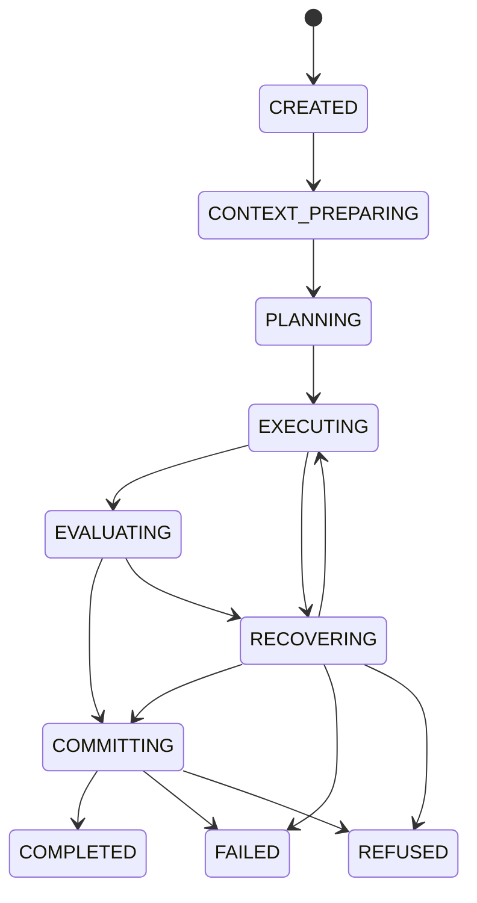

# 阶段三 Research Harness

记录日期：2026-08-06。生产 Web 与 CLI 的组合入口分别是 [`LocalRAGWebRuntime._build_service`](../../app/web/runtime.py) 和 [`agentic_service_from_args`](../../main.py)，二者都构造 [`HarnessAgentService`](../../app/research/runtime.py)，再由 [`build_harness_agent_service`](../../app/research/runtime.py) 将 Unified Knowledge Service、Workspace Service 和结构化 Generator 注入 Tool Gateway。Workflow 与 Agent 不持有知识引擎、Repository、索引目录或数据库连接。

## 顶层状态机

状态与合法迁移由 [`HarnessState` 和 `_TRANSITIONS`](../../app/research/harness.py) 固化。顶层没有 lexical、dense、graph 或 community 状态；这些细节只能出现在 `knowledge.retrieve` 内部诊断。每个 Run 由 [`ResearchRunHarness`](../../app/research/harness.py) 分配 `RR_*` ID，记录通用 Step、Tool、Context、Budget、Evaluation、Recovery 与 termination reason。

## 六个控制面

| 控制面 | 实现 | 责任 |
|---|---|---|
| Context | [`ResearchContextManager`](../../app/research/context.py) | 为 Router 和 Generator 构造不同的最小 ContextPack |
| Tool | [`ToolGatewayRegistry`](../../app/research/tools.py) | Schema、权限、Scope、预算、重试、超时与副作用治理 |
| Workflow | [`app/research/workflows.py`](../../app/research/workflows.py) | 四类固定工作流，不感知检索后端 |
| State & Memory | [`ResearchStateStore`](../../app/research/memory.py) | Workspace、Session、Run、Job 四层状态与长期白名单 |
| Evaluation & Trace | [`ResearchRunHarness.diagnostics`](../../app/research/harness.py) 与 [`RunTraceStore`](../../app/research/harness.py) | 记录选择证据、覆盖、冲突、Claim 校验、成本和恢复 |
| Policy & Recovery | [`ResearchBudgetPolicy`](../../app/research/harness.py) 与 [`ClaimEvidenceValidator`](../../app/research/validation.py) | 八类硬预算、确定性校验、降级与安全终止 |

安全 Trace 写入独立的 `data/research/runs/RR_*.json`，不会写入 Prompt、模型隐藏推理、异常正文、密钥或完整工具输出。[`HarnessAgentService`](../../app/research/runtime.py) 只为外部兼容投影 `answer/claims/citations/session/outcome/validation` 字段；它不改变 Workflow 的证据边界。

旧 [`AgenticRunHarness`](../../app/agentic/harness.py) 与 [`AgenticRAGService`](../../app/agentic/service.py) 已标记为 legacy，只用于阶段一行为回归、迁移适配和独立回滚。
