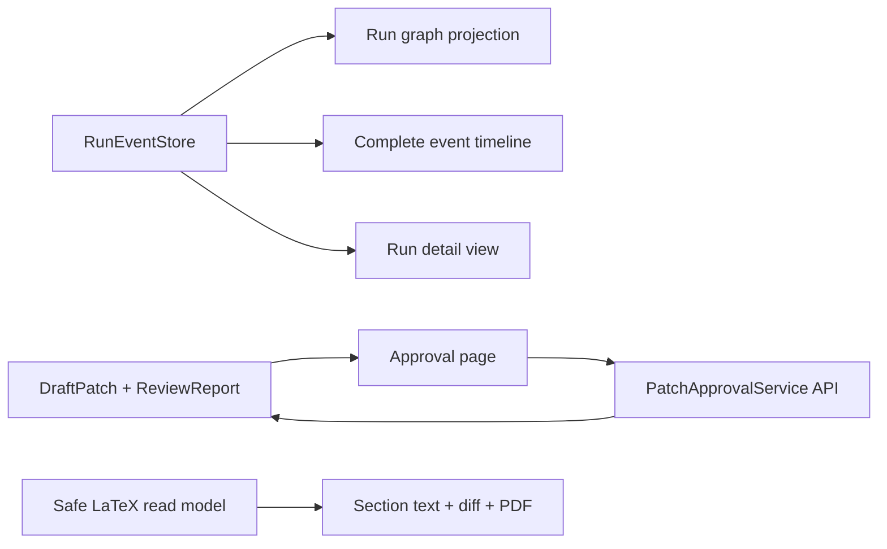

# Multi-Agent Web Control Plane

The Scholar Console has eight operating surfaces: New Task, Run History, Run
Detail, Manuscript, Evidence/Citations, Approvals, Evaluation, and System
Status. Run Detail is the primary view and projects only persisted structured
events.

Graph nodes are derived from event `node`, `type`, and `status`; the browser
does not infer workflow state from prose. Details are limited to structured
contracts, bounded tool metadata, timing, usage, trace IDs, and errors. Model
reasoning text, credentials, and sensitive arguments are excluded.

Dashboard/System status reads the formal backend projection, including the current
Knowledge Index state (`ready`, `degraded`, `not_initialized` or `stale`),
Paper/Content coverage and embedding revision. The Console does not create a
second workflow state and does not initiate index rebuilds. `/health` remains
liveness-only; `/ready` can report degraded Research readiness while Session,
Run, Approval and Console surfaces remain available.
The explicit `POST /api/scholar/runs/{run_id}/stop` entrypoint requests durable
cooperative cancellation and reports `CANCEL_REQUESTED` until the Worker reaches
its next safe checkpoint.
