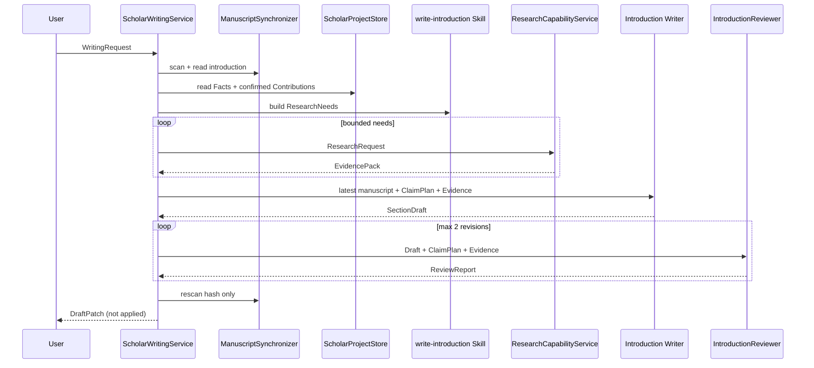

# Phase 2A Introduction Writing Vertical

## 当前边界

`ScholarWritingService` 是 Introduction 的领域编排边界。它只读取最新 LaTeX、Project Facts 和 confirmed Contribution，加载
`write-introduction` Skill，通过 `ResearchDelegate` 调用由 Freshness Policy 控制的
`ResearchCapabilityService`，生成 ClaimPlan、SectionDraft、ReviewReport 和未应用的
DraftPatch。它没有 LaTeX 写权限，也不访问 Qdrant、BM25、RRF、Graph Node 或
ResearchAgentState。

## Contract 和 Authority

`WritingRequest` 只允许 `target_section=introduction` 和 `mode=WRITE|REVISE`。`IntroductionSkill`
把请求拆成 technical problem、existing approaches、limitations 等 bounded ResearchNeed；它不
产生 Contribution。`ClaimPlan` 中 Literature Claim 的 source 是 Verified Evidence，Contribution
Claim 的 source 是 Project Registry，二者不共享同一个 authority。Writing Service 只消费
`status=confirmed` 且 `confirmed_by_user=true` 的 Contribution；任何 selected candidate、事实
冲突或错误 project_id 都返回 conflict，不自动选择低权威来源。

写作上下文只包含当前 Introduction/hash、相关 Facts、confirmed Contributions、ClaimPlan、
EvidencePack 和 Citation Requirement。`SectionDraft` 必须携带 claim_ids、evidence_ids、
citation_keys、contribution_ids、original_content 和 base_hash。Reviewer 只读这些结构化
内容，不自行修改 Evidence、Facts、Contribution 或 Manuscript。Introduction 还携带
CitationBinding ID；BibKey 只是当前 `references.bib` 同步后的 render 属性。

## Citation 与 Review

Citation Resolver 通过 Project 的 `references.bib` authority 和 Citation Registry
解析 Evidence 的 Bibliographic Identity。已有用户 BibKey 总是优先；没有 entry 但
Verified Metadata 足够时生成待审批 `BibEntryCandidate`/`BibliographyChange`，不足时生成
`CitationRequirement`，不生成随机或模型臆造的 `\\cite{}`。Reviewer 确定性检查 locator/evidence
引用、Citation Grounding、Contribution Authority、基础 Fact consistency 和夸张措辞；可选的
`ChatCompletionSemanticReviewJudge` 只返回 ReviewIssue，不修改任何事实或来源。BLOCKER/HIGH
会把结果标记为 `NEEDS_USER_REVIEW`，Revision Loop 最多两轮。

## Patch 与权限

Reviewer 通过时 Phase 2A 将 DraftPatch 标为 `approved`，但它仍必须进入 Phase 2B 的
`AWAITING_APPROVAL` 生命周期；存在 BLOCKER/HIGH 时仍可返回 `needs_user_review` 的 Patch
供用户检查，但 Backend Review Gate 不允许应用。Patch 保存 project_id、target section、
base_hash、original/proposed content、claim/evidence/citation/contribution 关联、review report
和 warnings，并由 Project-owned Patch Store 跨请求保存。Runtime CapabilitySet 仅包含
manuscript/workspace/facts/contributions/research/evidence/citation/reviewer 的 read/run 能力，
不包含 manuscript.write、facts.write、contributions.write、patch.approve；`research.web` 也只能
通过 ResearchCapabilityService 的 Runtime Policy 间接使用。

Phase 2A 的 Introduction 垂直不直接调用 Web；Phase 2D 允许其 ResearchRequest 在
CapabilityProfile 允许且 Freshness Policy 判定需要时，经 ResearchCapabilityService 使用受控
Web Literature。CrewAI Manager 现在只通过 Flow 调用该 Runtime；它不能改变
Writing Skill、Reviewer、DraftPatch 或 Approval 边界。自动 Apply 或其它 Writing Skill 仍不在该边界内。Phase 2B 的
人工审批和安全落盘边界见 [`human-approval-latex-loop.md`](human-approval-latex-loop.md)。

Phase 2C 的 Conclusion、Abstract 和 Support Claim 不创建平行 Writing Pipeline；它们通过
共享 Skill Runtime 复用 `CapabilityProfile`、`SkillExecutionContext`、Reviewer 和
DraftPatch。Support Claim 不生成 DraftPatch，Conclusion/Abstract 默认关闭 Research、Evidence
和 Citation。详见 [`skill-runtime.md`](skill-runtime.md)。

Introduction 的 CitationBinding 和 bibliography change 仍然只是 Draft Proposal；`.bib`
与 `.tex` 均由 Phase 2B Human Approval Apply 边界写入。Conclusion/Abstract 保持
Citation OFF。完整 identity、BibKey、External Evidence projection 和并发 `.bib`
编辑规则见 [`citation-lifecycle.md`](citation-lifecycle.md)。

Phase 3B 的 Web、CLI Scholar-level 请求由同一个
`Harness → ScholarOrchestrationService` 进入该 Writing Runtime；Manager
只负责用户级规划、Context 隔离和调用既有 Skill，不改变 Introduction、Conclusion、
Abstract 的 CapabilityProfile，也不获得 `.tex`、`.bib` 或 Patch Approval 权限。
